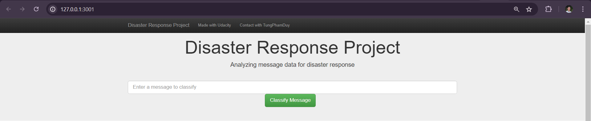
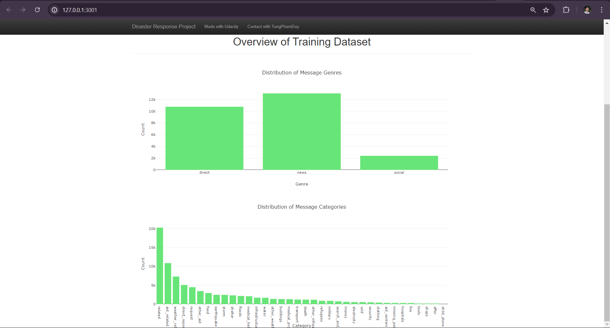
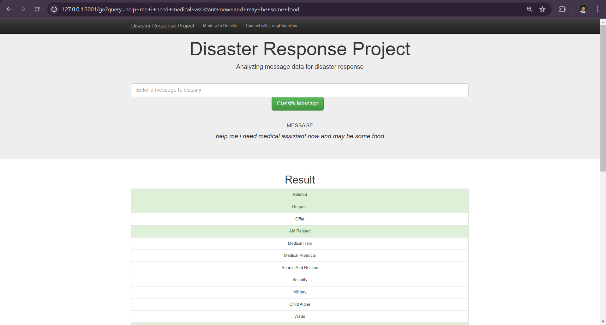

# Disaster Response Pipeline Project

## Project Overview 
This project is part of the Udacity Data Scientist Nanodegree. This project tackles the challenge of classifying disaster messages. By training a Natural Language Processing model on real disaster data, it empowers responders to quickly understand the nature of incoming messages and react effectively.

## Files in the repository
```
+---app
|  \---templates
|          <> go.html
|          <> master.html
+---data
|          categories.csv
|          DisasterResponse.db
|          messages.csv
|          process_data.py
+---images
|          classified_message.png
|          homepage.png
|          visualizations.png 
\---models
|          train_classifier.py
|---README.md
|---requirements.txt
```

## Installation
Install the necessary libraries
```bash
pip install -r requirements.txt
```

### Instructions:
1. Run the following commands in the project's root directory to set up your database and model.

- To run ETL pipeline that cleans data and stores in database:

`python data/process_data.py data/messages.csv data/categories.csv data/DisasterResponse.db`

- Expected output:

```
Loading data...
    MESSAGES: data/messages.csv
    CATEGORIES: data/categories.csv
Cleaning data...
Saving data...
    DATABASE: data/DisasterResponse.db
Cleaned data saved to database!
```

- To run ML pipeline that trains classifier and saves:

`python models/train_classifier.py data/DisasterResponse.db models/classifier.pkl`

- Expected output:

```
Best parameter...
{'clf__estimator__min_samples_split': 2, 'clf__estimator__n_estimators': 20}
...
Category: direct_report
              precision    recall  f1-score   support

           0       0.85      0.98      0.91      4208
           1       0.78      0.33      0.46      1036

    accuracy                           0.85      5244
   macro avg       0.82      0.65      0.69      5244
weighted avg       0.84      0.85      0.82      5244

Accuracy: 0.8485888634630053
F1 score: 0.822509670332959
Precision: 0.8399912434285646
Recall: 0.8485888634630053
Saving model...
    MODEL: models/classifier.pkl
Trained model saved!
```
 
2. Run your web app: `python app\run.py`

3. Open `http://127.0.0.1:3001/` in your web browser.  
### Homepage

### Visualizations

### Classified message

